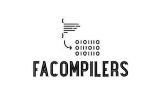

# RenuLogix EagleView


## Description
Renulogix Eagleview provides the accuracy and automation when it comes to designing solar installation plans for customers. The increase in precision and accuracy of measurements provided by Eagle view allows solar installers to devise the best plans for solar installation for the project at hand with highly detailed 3D images of the project site. <br>


## Tech Stack
**Client:** HTML, CSS, JavaScript <br>
**Server:** Go<br>
**Database:** AWS MySQL<br>

## Installation
Running the project with VSCode IDE or CMD <br>
Follow the guide below to setup the Go environment ~ https://go.dev/doc/install<br>
Clone the project in CMD or the IDE terminal <br>

``` 
    git clone https://gitlab.com/PRattan0880/senior-project.git 
```

## Run Locally
Once in the project folder
To install dependencies

``` 
   go mod tidy 
```
Run the application using an VSCode IDE or CMD

``` 
   go run main.go 
```

## User Manual
Consult the user manual to understand the functionality of the project and all of its individual screens.

[User Manual](https://drive.google.com/file/d/1zJD6azMuKUhTeXDQHNTJF73oUddA_nua/view?usp=sharing)

## System Test Report
Consult the system test report to lean how to view and run the test configured for this project

[System Test Report](https://drive.google.com/file/d/1L9kXmdEbrxuUT1sUHb2mFNsio-fWvIZr/view?usp=sharing)

## Maintenance Manual
Consult the Maintenance manual to learn how to maintain the code and deploy the application.

[Maintenance Manual](https://drive.google.com/file/d/1VEIpsT4aOiqL1Pa5Gh8bFx78gKXHqjSv/view?usp=sharing)

## Authors and acknowledgment
<br>
Sharnpreet Singh<br>
Palvinder Singh<br>
Maryam Siddique<br>
Jianlian Luo<br>
Kimia Arad<br>
Ryon Faroughi<br>
Youser Alalusi<br>
Yusran Sadman<br>


